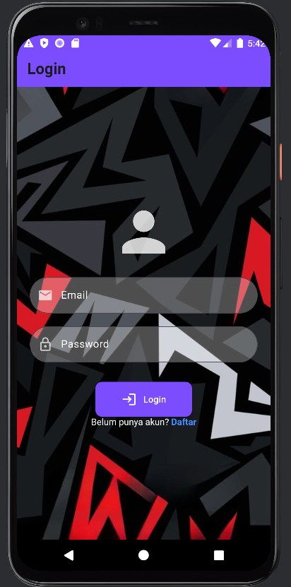
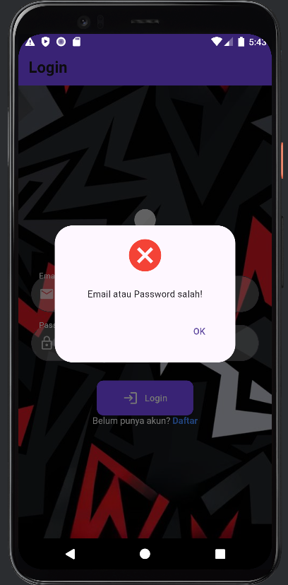
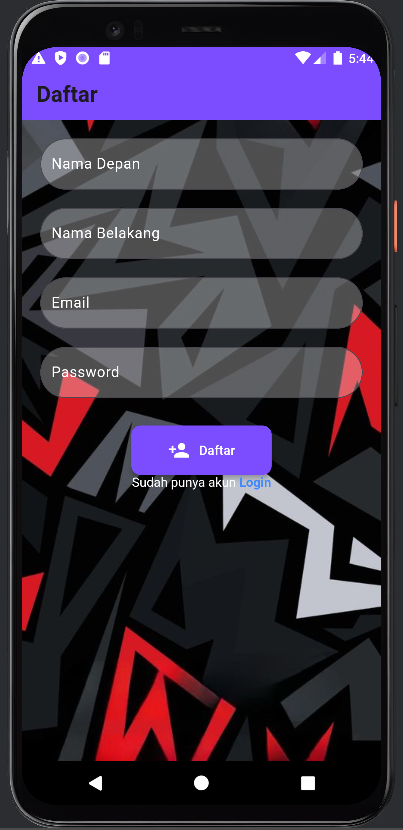
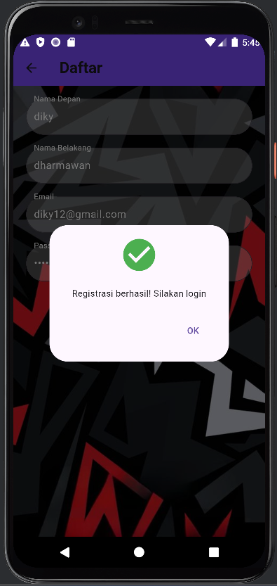
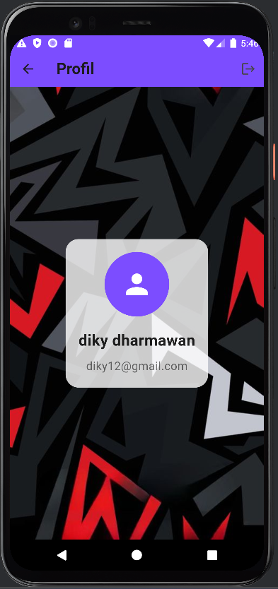

# loginregister

# 362358302047_Ahmad Diky Dharmawan
, Tampilan login,
 
, Tampilan login bila email/password salah,
 
, Tampilan register,
 
, Tampilan apabila pengguna sudah melakukan pendaftaran,
 
, Tampilan halaman profile, dan ada icon log out dipojok kanan atas, apabila di klik akan kembali menuju login,

## Getting Started

This project is a starting point for a Flutter application.

A few resources to get you started if this is your first Flutter project:

- [Lab: Write your first Flutter app](https://docs.flutter.dev/get-started/codelab)
- [Cookbook: Useful Flutter samples](https://docs.flutter.dev/cookbook)

For help getting started with Flutter development, view the
[online documentation](https://docs.flutter.dev/), which offers tutorials,
samples, guidance on mobile development, and a full API reference.
